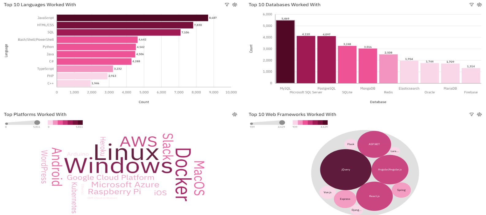
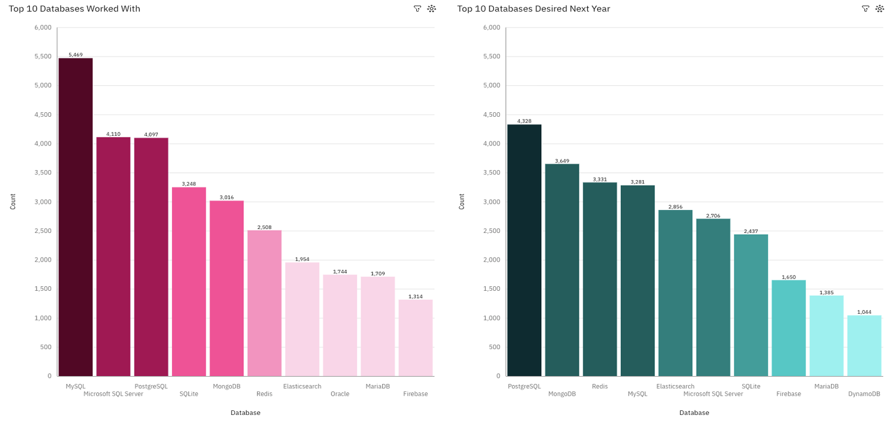
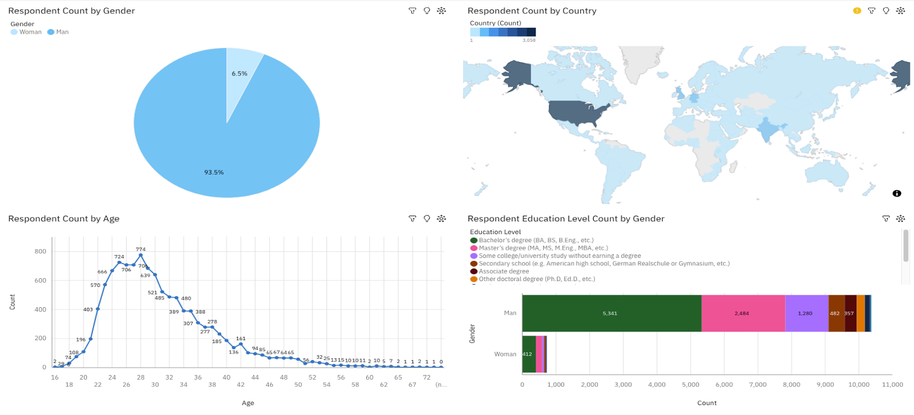
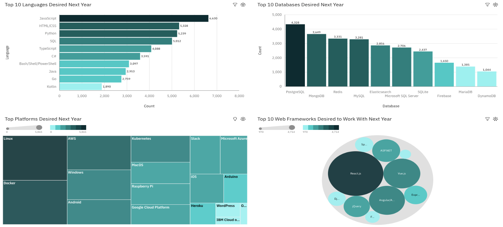
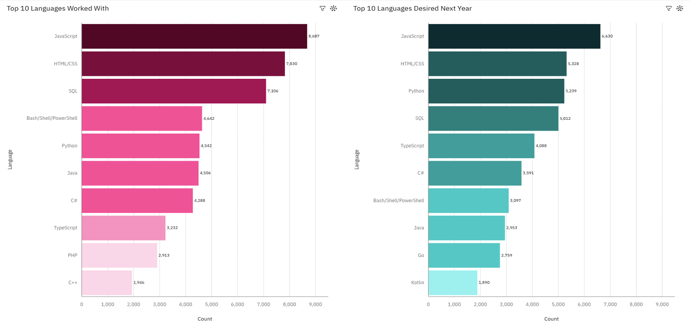

# 💡 Emerging Trends in Software Development  

A Data-Driven Exploration of Technology Preferences and Career Insights

This project analyzes developer preferences, technology usage, and career priorities using survey data from Stack Overflow, GitHub Jobs, and other sources. It combines Python-based data analysis with IBM Cognos dashboards to uncover trends in programming languages, databases, platforms, and job factors.

---

## ✨ Features  
- Cleaned and transformed survey data for analysis  
- Interactive dashboards built in IBM Cognos  
- Visualizations of current and future tech preferences  
- Insights into developer demographics and job motivations  
- Comparative analysis of salaries and job postings by language  
- GitHub-ready structure for showcasing as a portfolio project

---

## 📁 Project Structure

Capstone-Tech-Trends/
```
├── data/
│   └── data_source.md │
├── images/│
│   └── current_tech_usage.png │
│   └── database_trends.png │
│   └── demographics.png │
│   └── future_tech_trend.png │
│   └── programming_language_trends.png │
├── coding.txt
├── README.md
├── .gitignore
├── LICENSE

```

---

## 📊 Dataset  
- **Primary Source**: Stack Overflow Developer Survey, [survey_data_updated CSV](https://cf-courses-data.s3.us.cloud-object-storage.appdomain.cloud/VYPrOu0Vs3I0hKLLjiPGrA/survey-data-with-duplicate.csv)
- **Supplementary Sources**: GitHub Jobs API, PromptCloud, IBM Skills Network  
- See [`data/data_source.md`](data/data_source.md) for full details.
- Contains responses on technologies used, desired tools, job satisfaction, compensation, and demographics.

---

## 🛠️ Technologies Used  
- **Python**: Core language for data wrangling and visualization  
- **Jupyter Notebook**: Interactive coding and documentation  
- **Pandas**: Data manipulation and cleaning  
- **Matplotlib**: Static visualizations  
- **Seaborn**: Advanced statistical plots  
- **IBM Cognos Analytics**: Dashboard creation and interactive visual storytelling

---

## 📈 Visualizations

### 1. `current_tech_usage`  
- Bar charts, word clouds, and bubble charts showing technologies respondents currently use


### 2. `database_trends`  
- Comparative bar charts of databases worked with vs. desired next year  
- Insights into relational vs. NoSQL adoption


### 3. `demographics`  
- Pie charts, maps, and line graphs showing gender, age, country, and education distributions


### 4. `future_tech_trend`  
- Dashboards showing desired technologies for the upcoming year  
- Includes programming languages, platforms, and web frameworks


### 5. `programming_language_trends`    
- Horizontal bar charts comparing usage and desirability


---

## 🔍 Insights

- **Web technologies dominate**: JavaScript, HTML/CSS, and Python lead both usage and desirability.
- **Simplicity matters**: Languages with clean syntax and strong typing (e.g., TypeScript, Go) are gaining traction.
- **NoSQL rising**: MongoDB, Redis, and Firebase show increasing interest compared to traditional SQL databases.
- **Developers prioritize tools**: The most important job factor is the technologies used on the job.
- **Youth-driven innovation**: Most respondents are aged 22–32, driving demand for modern, flexible tools.
- **English-centric ecosystem**: The dominance of English-speaking countries shapes language and platform preferences.

---

## 📜 License  
This project is licensed under the 
[Creative Commons BY-NC-ND 4.0](https://creativecommons.org/licenses/by-nc-nd/4.0/)

You may view and learn from the content, but **you may not reuse, redistribute, or modify it** for commercial or derivative purposes without permission.

---

## 📬 Contact  
Feel free to connect with me on [LinkedIn](https://linkedin.com/in/sidney-dang) or email at kyledang2711@gmail.com if you'd like to discuss this project or any opportunities.

---
